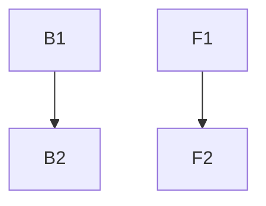

# {ticketId} 可执行任务清单

## 执行方式

本计划使用 **subagent-driven-development** 执行：
- 每个任务分配一个独立的 implementer subagent
- 每个任务完成后经过两阶段审查：spec compliance → code quality
- 所有任务完成后进行最终代码审查

## 后端任务

### Task B1: {任务名称}
- **文件**: `{文件路径}`
- **类型**: {新增/修改}
- **步骤**:
  1. {具体步骤}
  2. {具体步骤}
- **验收标准**:
  - {验收标准}
  - {验收标准}
- **依赖**: {无/Task Bx}

## 前端任务

### Task F1: {任务名称}
- **文件**: `{文件路径}`
- **类型**: {新增/修改}
- **步骤**:
  1. {具体步骤}
  2. {具体步骤}
- **验收标准**:
  - {验收标准}
  - {验收标准}
- **依赖**: {无/Task Fx}

## 依赖关系

