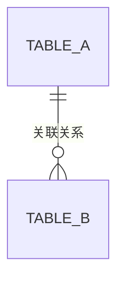

# {ticketId} 数据库设计

## 表清单
| 表名 | 说明 | 预估数据量 | 所属服务 |

## 表结构

### {table_name}
| 字段 | 类型 | nullable | 默认值 | 说明 | 索引 |

## ER 图


```mermaid
erDiagram
    TABLE_A ||--o{ TABLE_B : "关联关系"
```

## 索引清单
| 表名 | 索引名 | 类型 | 字段 |

## 数据迁移脚本
```sql
-- 建表语句
```
