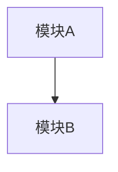

# {ticketId} 代码图谱摘要（CodeGraph）

## 1. 项目结构
| 服务/模块 | 路径 | 说明 |

## 2. 模块依赖

## 3. 已有 API 清单
| 方法 | 路径 | 所属 Controller | 说明 |

## 4. 已有数据库表
| 表名 | 说明 | 关键字段 |

## 5. 关键类清单
| 类名 | 类型 | 路径 | 说明 |

## 6. 变更影响范围
| 文件/模块 | 影响类型 | 说明 |

## 7. 可复用代码建议
| 类/方法 | 复用场景 | 说明 |
