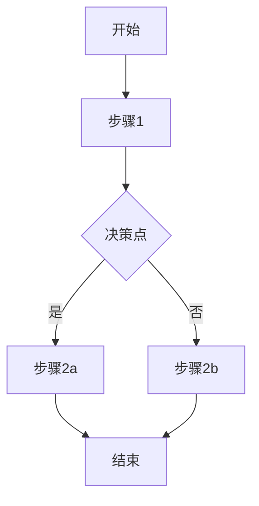

# Flowchart Skill

Parse Markdown requirement documents and generate Mermaid flowchart images.

## Workflow

1. **Wait for input**: User pastes Markdown requirement document after invoking the skill
2. **Parse document**: Extract workflow nodes and relationships
3. **Generate Mermaid**: Create Mermaid diagram code
4. **Render image**: Use mmdc to generate PNG
5. **Save output**: Save to `~/Downloads/flowchart-YYYYMMDD-HHMMSS.png`
6. **Report**: Show the file path to the user

## Parsing Strategy

Identify these patterns in Markdown:

**Sequential steps:**
- Chinese: 首先、然后、接下来、最后、以及
- English: first, then, next, finally, also, and then

**Decision points:**
- 如果、是否、当...时、假如
- if, when, whether, decision

**Parallel processes:**
- 同时、并发、并行
- simultaneously, parallel, concurrent

**Node extraction:**
- Extract action verbs and their objects
- Detect relationships (→, →, ↓)
- Group into start/process/decision/end nodes

## Mermaid Template



## Implementation

### Step 1: Parse Markdown

Use Node.js to parse and extract flow elements:

```javascript
const parseFlowchart = (markdown) => {
  const nodes = [];
  const edges = [];

  // Extract lines with flow indicators
  const lines = markdown.split('\n');

  // Patterns for flow detection
  const stepPatterns = [
    /^[#\s]*[-*]?\s*(首先|然后|接下来|最后|以及|首先|其次)/,
    /^[#\s]*[-*]?\s*(if|when|then|next|finally)/i,
  ];

  const decisionPatterns = [
    /(如果|是否|当|假如|whether|if)\s*[,，：:]/,
  ];

  // Parse each line
  lines.forEach((line, index) => {
    // Check for step markers
    if (stepPatterns.some(p => p.test(line))) {
      nodes.push({ id: `N${index}`, label: line.replace(/^[-*#\s]+/, '') });
    }
    // Check for decision points
    if (decisionPatterns.some(p => p.test(line))) {
      nodes.push({ id: `D${index}`, label: line.replace(/^[-*#\s]+/, ''), type: 'decision' });
    }
  });

  return { nodes, edges };
};
```

### Step 2: Generate Mermaid Code

```javascript
const generateMermaid = ({ nodes, edges }) => {
  let mermaid = 'graph TD\n';

  nodes.forEach((node, i) => {
    const shape = node.type === 'decision' ? `{${node.label}}` : `[${node.label}]`;
    const nextNode = nodes[i + 1];
    if (nextNode) {
      mermaid += `    ${node.id}${shape}\n`;
      mermaid += `    ${node.id} --> ${nextNode.id}\n`;
    }
  });

  return mermaid;
};
```

### Step 3: Render to PNG

```bash
# Create mermaid input file
echo "$MERMAID_CODE" > /tmp/flowchart.mmd

# Render with mmdc
~/.npm-global/bin/mmdc \
  -i /tmp/flowchart.mmd \
  -o ~/Downloads/flowchart-$(date +%Y%m%d-%H%M%S).png \
  -w 1200 -H 800
```

## Error Handling

- **No flow detected**: Ask user to clarify the steps
- **mmdc not found**: Prompt to install via `npm install -g @mermaid-js/mermaid-cli`
- **Render failure**: Output Mermaid code for manual rendering

## Output

- Default: Save to same directory as the requirement document (if path provided)
- Fallback: Save to current working directory as `flowchart-YYYYMMDD-HHMMSS.png`
- Format: PNG (high resolution 2x)

Always show the final file path:
```
流程图已生成: /path/to/flowchart-20260512-143052.png
```